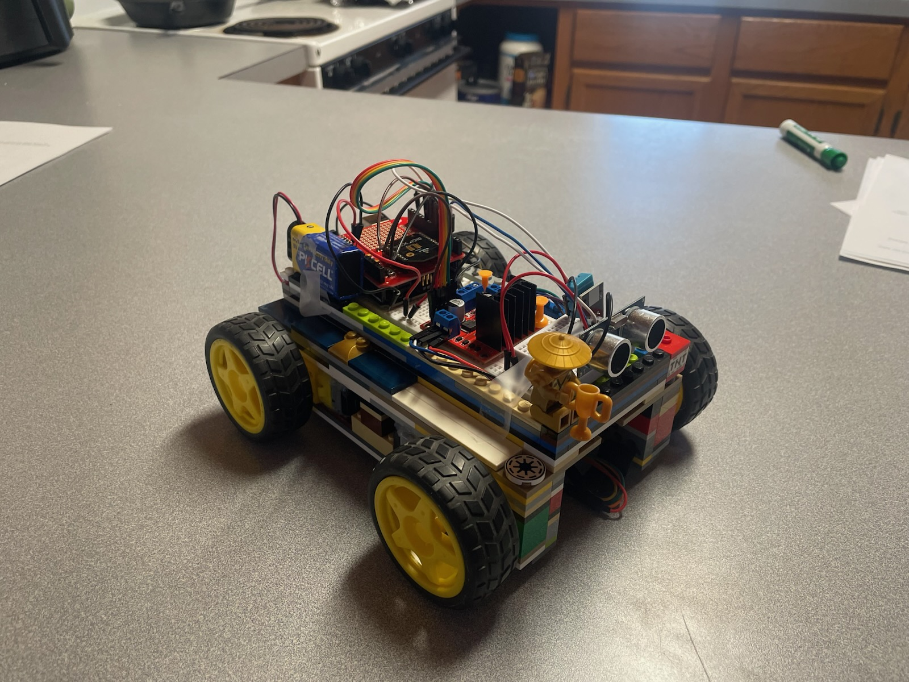
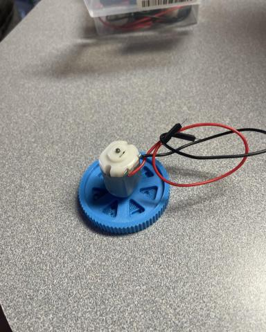
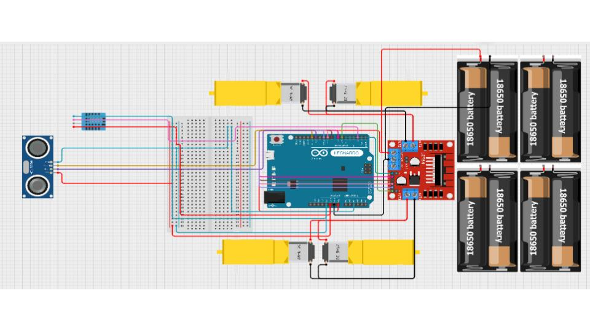
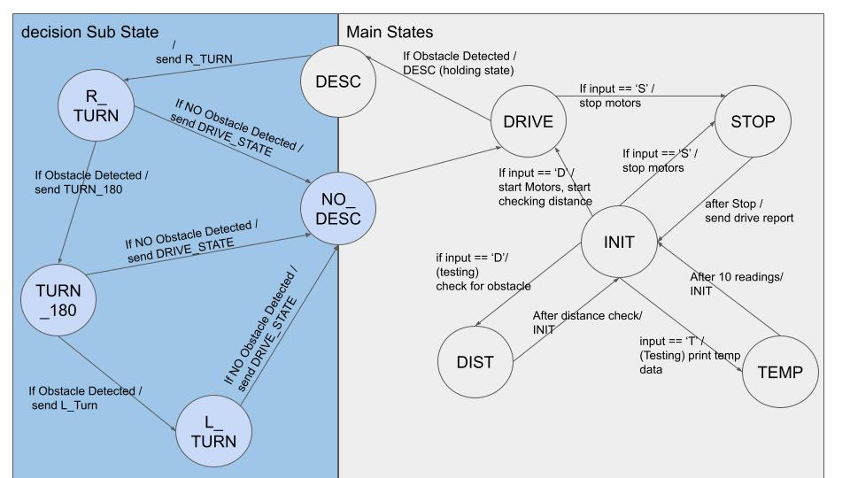
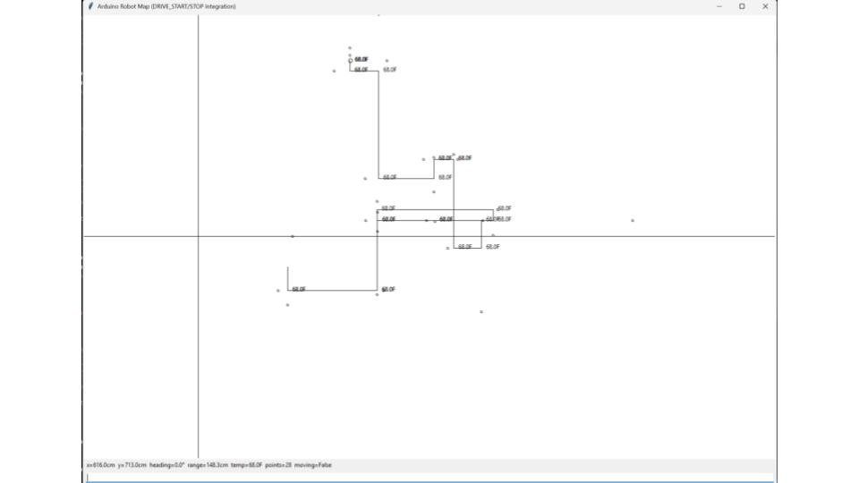

# IoT Final Project

## Problem
The Rady building on the Western Colorado University campus is notorious for having super-inconsistent
temperatures. Even though it is brand new, their fancy thermo heating and cooling have failed.

## Solution Statement
We decided to build an autonomous robot that can navigate around the Rady building and monitor
temperatures throughout it. With this tracking program, we can ideally determine the spot on the robot's
map with the lowest temperature.

## First Idea
At first, we attempted to drive the vehicle with the DC motors from our Arduino Kit. We experience
frequent power and functionality issues, as well as overall inconsistency. There were a lot of factors at
play, but the simplest part was supposed to be getting it to drive, which we were unable to do with the
basic DC motors and 3D printed wheels. Additionally, we were interested in using a gyroscope to
measure the degrees we were turning so that we could not only turn by accurate amounts, but also map
our exact turn in TKinter.

## Revisions

We decided to use a motor driver (L298N) and a wheel kit we found on Amazon. This helped get our
vehicle driving, but we were still having problems turning and driving consistently. We discovered that
the battery pack we were using was only supplying half the voltage the driver could handle, so we added
another inline battery pack and began getting much more consistent results. However, we ran out of time
to integrate the gyroscope, so we relied on precise timing and PWM to turn. We limited our turning
functions to 90 degrees to the Left and Right and a 180-degree turn.

## End Product

By the time we finished the Prototype, we had a vehicle that could decide which turns to make when
facing an obstacle; however, we were unable to achieve consistent 90-degree and 180-degree turns. This
is likely because our battery pack runs on AA batteries, which cannot withstand the current spikes caused
by the wheels' Pulse Width Modulation. Several other factors contribute to inconsistent turns, including
having only 1 Ultrasonic Sensor to detect obstacles and the weight of our vehicle. Altogether, these
factors lead to inconsistent mapping of the environment.

## Ideal World Goal

If we had time and better/more consistent parts, we would want to implement an accelerometer sensor
that sends actual turn data to our Python mapping. Consistent wheels and a battery pack designed to
withstand surge currents are mandatory for accurate results. Lastly, we need to rethink the frame of our
vehicle to be lighter.

## Parts Used
  * 2x 4-AA Battery pack
  * 4x DC Motors
  * 1x L298N DC motor drive
  * 1x DHT11 Humidity and Temperature Sensor
  * 1x HC-SR04 Ultrasonic Sensor
  * 1x Arduino Uno
  * 1x xBee Shield
  * 2x xBee radio

## Wiring Diagram

## How the Data Flows
  * The Arduino robot collects temp and distance data
  * Goes into our state machine, where it then makes decisions based on the received data
  * Decides whether or not to turn
  * Transmits over our XBee radios to Python
  * State decisions determine mapping in Python

## Design Overview
Start robot with some sort of input (D, C, T, R, L)
  * D: DRIVE state
  * C: check DIST state*
  * T: TEMP state*
  * R: manual RIGHT turn
  * L: manual LEFT turn
  * S: manual STOP
    
      *used for testing purposed

If (D) → Robot begins autonomous navigation
  * mapping its direction and distance
  * updating the map in real time

When the robot encounters an obstacle
  * It moves into the Decision Substate
  * records an obstacle and updates the map
  * decides which turn(s) it needs to make
    - updating the direction of the vehicle on the map
    - based on the type and number of turns

When there are no Obstacles in front of it
  * The temperature data is taken and updated on the map
  * and it returns to the DRIVE state

## State Diagram:

## Tkinter
  * Our tkinter program will show the robot moving with a line behind it
  * Once the robot starts moving, it starts mapping
  * When it hits an obstacle, we mark the obstacle on the map along with our point and its temperature
  * Based on what happens in our state machine, it will map turns in python
  * Not perfect because we are assuming that the turns are perfect 90-degree turns
  * If it gets stuck, there might be some inaccurate mapping data
Creates a map like this:

## Known Issues
  * Cheap parts make it so the motors are inconsistent
    - The longer it goes, the more the performance decreases
    - Starts getting inconsistent with turning, which makes our map inaccurate
  * Time restraints didn't allow us to implement things like an accelerometer or a manual drive with joysticks state

## Conclusion
While we met the Project's requirements, we encountered several issues. If the project were to continue,
the Prototype would be scrapped, and we would need to rethink many stages. A lot of the components of
the project would need to be upgraded, including:
  * The Wheels and motors
  * An additional motor driver
  * A Lithium battery pack
  * Additional ultrasonic sensors
  * Integrating a gyroscope/ accelerometer
  * Rescaling the map in real time
  * Redesigning the frame to reduce weight
